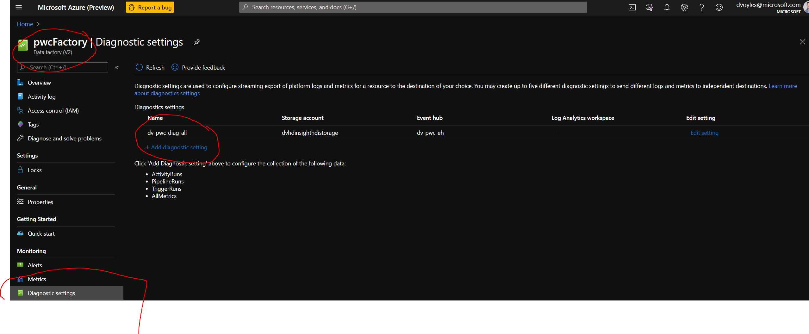
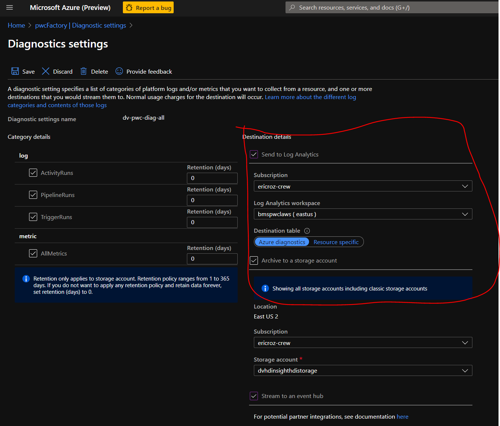

# Create alerts to proactively monitor your data factory pipelines

Organizations can improve operational productivity by creating alerts on data integration events (success/failure) and proactively monitor with Azure Data Factory (ADF).

[This document from Microsoft](https://azure.microsoft.com/en-us/blog/create-alerts-to-proactively-monitor-your-data-factory-pipelines/) offers detailed instructions on how to enable monitoring within ADF.

But connecting ADF to Azure Monitor, you can:
* Archive logs to a storage account
* Stream to an event hub
* Send to Log Analytics

---
### Azure Monitor
ADF's monitoring solution is built on [Azure Monitor.](https://docs.microsoft.com/en-us/azure/azure-monitor/overview) Azure Monitor maximizes the availability and performance of your applications and services by delivering a comprehensive solution for collecting, analyzing, and acting on telemetry from your cloud and on-premises environments. 

It helps you understand how your applications are performing and proactively identifies issues affecting them and the resources they depend on.

The following diagram gives a high-level view of Azure Monitor. At the center of the diagram are the data stores for metrics and logs, which are the two fundamental types of data use by Azure Monitor. 


On the **left** are the **sources** of monitoring data that populate these data stores. On the **right** are the different **functions** that Azure Monitor performs with this collected data such as analysis, alerting, and streaming to external systems.

All data collected by Azure Monitor fits into one of two fundamental types, **metrics** and **logs**.

* **Metrics:** Numerical values that describe some aspect of a system at a particular point in time. They are lightweight and capable of supporting near real-time scenarios.

 * **Logs:** Contain different kinds of data organized into records with different sets of properties for each type. Telemetry such as events and traces are stored as logs in addition to performance data so that it can all be combined for analysis.

We can manage this from two different locations. The first is from **within** ADF itself, which is the more simple solution, although somewhat limited when compared to managaging this within the portal. Let's explore ADF first.

### 1. Mangage alerts within Data Factory


In ADF you can configure the alert logic. You can specify various filters such as activity name, pipeline name, activity type, and failure type for the raised alerts. You can also specify the alert logic conditions and the evaluation criteria.


#### Notifications from Data Factory 
Upon fulfillment of your parameters (Pass or Fail), an alert will be sent out. It takes ~2 minutes to reach my inbox. 

Different mechanisms such email, SMS, voice, and push notifications are supported.


----

### 2. Manage rules/alerts from within the Azure Portal
You can also manage and view these rules from within the Azure portal, which is more complex, but offers far more control, particularly with monitoring.


You can find this by click on the Monitoring -> Alerts pane:


### Keeping Azure Data Factory data
Data Factory stores pipeline-run data for only 45 days. Use Monitor if you want to keep that data for a longer time. With **Azure Monitor**, you can route diagnostic logs for analysis. You can also keep them in a storage account so that you have factory information for your chosen duration.

#### Diagnostic logs
From here you can send metrics & logs to 3 destinations:


 #### Azure Data Factory Management Solution Service Pack
[This video from Scott Hanselman](https://docs.microsoft.com/en-us/azure/data-factory/monitor-using-azure-monitor#monitor-data-factory-metrics-with-azure-monitor) has step-by-step instructions on how to configure Azure Data Factory Analytics with Azure Monitor.  

**This is not what you are looking for.** This has you configuring Azure Monitor to point towards your Data Factory instance, rather than have Data Factory point towards Azure Monitor.  It requires the 
 [Azure Data Factory Management Solution Service Pack](https://azuremarketplace.microsoft.com/en-us/marketplace/apps/Microsoft.AzureDataFactoryAnalytics?src=azserv&tab=Overview).


#### The problem with this approach
This issue that with the approach is that Data Factory must be made in **your** subscription. For example, if a peer made the Data Facotry instance, and then you tried to connect Monitor to it, it would not work. Therefore, we need to **connect to  Monitor from *within* Data Factory.** Below I illustrate how to do that. 

### Monitor Data Factory metrics with Azure Monitor
From the Azure Portal, click on your Data Factory instance, and on the left-hand side look  for *Diagnostic settings*. 

Diagnostic settings are used to configure streaming export of platform logs and metrics for a resource to the destination of your choice. You may create up to five different diagnostic settings to send different logs and metrics to independent destinations.



You can add new diagnostic settings from here by clicking on the *+Add diagnostic setting* button. 


More details around diagnostic settings can be found [in the documentation.](https://docs.microsoft.com/en-us/azure/azure-monitor/platform/diagnostic-settings)

**NOTE:** All of these need to be in the same region (EX: *East US 2*) as the Data Factory.


### 1. Archive to a storage account
You'll need to create a storage account **in the same resource group and region** as your data factory in order to archive logs to it.

After a run is executed from within Data Factory, you'll see the results written to the new containers within your linked storage account. These containers are created automatically by Azure, upon linking it to the logging service. 


The folder hierarchy within each of these containers will be **long**. In my example, the logging document (```.json```) was nested 8+ folders deep. 

The end result will be a ```.json``` file with information about the run. 

You can find an example of this file in the ```/monitoring-output``` folder included with this README.

### 2. Sending to an event hub
You'll need to create an event hub in your subscription first, and then from within the Data Factory's **Diagnostic Settings** you can link to your event hub namespace.


### 3. Logging to an Analytics workspace
You'll ned to create a Log Analytics workspace from within the Azure Portal before you can link it to this Data Factory. 


From there you can link it to your Data Factory diagnostics in the Azure portal:



---
### Pricing details
#### Log Analytics
For Azure Monitor Log Analytics, you pay for data ingestion and data retention.

#### Data Ingestion
There are two ways to pay for ingesting data into the Azure Monitor Log Analytics service: 
1. Capacity Reservations 
2. Pay-As-You-Go.

[More information can be found on the costs page](https://azure.microsoft.com/en-us/pricing/details/monitor/)

Although you can see below, that it cost me ~$0.10 per month for this alert.


---------------
### Resources
* [Create alerts to proactively monitor your data factory pipelines](https://azure.microsoft.com/en-us/blog/create-alerts-to-proactively-monitor-your-data-factory-pipelines/)

* [Alert and monitor data factories by using Azure Monitor](https://docs.microsoft.com/en-us/azure/data-factory/monitor-using-azure-monitor#monitor-data-factory-metrics-with-azure-monitor)

* [Azure Monitor overview](https://docs.microsoft.com/en-us/azure/azure-monitor/overview)

* [Azure Data Factory Management Solution Service Pack](https://azuremarketplace.microsoft.com/en-us/marketplace/apps/Microsoft.AzureDataFactoryAnalytics?src=azserv&tab=Overview)

* [Azure Monitor Pricing](https://azure.microsoft.com/en-us/pricing/details/monitor/)

* [Create diagnostic setting to collect resource logs and metrics in Azure](https://docs.microsoft.com/en-us/azure/azure-monitor/platform/diagnostic-settings)

-----------------
###### Prepared by [Dave Voyles](dvoyles@microsoft.com), Microsoft Corp | May 2020